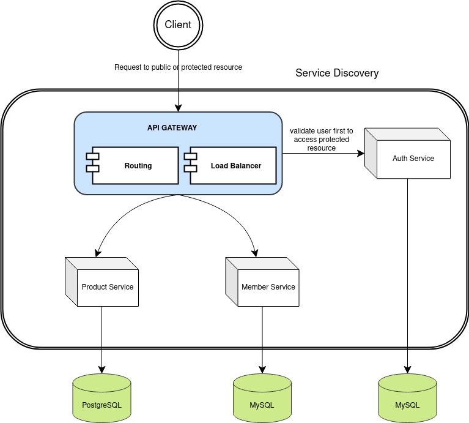

# Spring Boot Microservices with Docker

This project demonstrates microservices architecture with Spring Boot and run it with Docker Compose.

This simple application comprised of:
- Spring Framework (Spring Boot)
- An Authentication using JWT.
- Database (PostgreSQL & MySQL)
- Netflix Zuul for api gateway.
- Eureka Server as service discovery.
- Docker for manage every container with an internal network between the service.

## Getting Started

Assume you already have Docker Compose installed. See https://docs.docker.com/compose/install/.

To install this application, run the following commands:

```
git clone https://github.com/residwi/spring-microservices-docker.git
cd spring-microservices-docker
```

Run the following command to create Docker containers for all your apps.

`./mvnw clean install`

Then you can start the application using Docker Compose:

`docker-compose up -d`

After everything starts, you can open your browser to http://localhost:8888.

## Services

You can check all services that registers to service-discovery at http://localhost:8761

- **api-gateway**: Netflix Zuul. It’s a proxy, gateway, an intermediate layer between the client and the services.
- **auth-service**: Authentication with JWT for validate the user credentials, generate a token, or throw an exception if not valid user.
- **config-server**: A service for manage a configuration every service.
- **member-service**: A persistence service for manage members.
- **product-service**: A persistence service for manage products.
- **service-discovery**: Eureka Server for service discovery. To automate deployment, so it's easy to scale.

## API Endpoints

### Auth Service

| Method | URI                | Description           |
| :----- | :----------------- | :-------------------- |
| `POST` | `/api/auth/signup` | Register new user     |
| `POST` | `/api/auth/signin` | Authentication a user |

#### Request body 

```http
POST /api/auth/signup
```

```json
{
    "email":"string",
    "phoneNumber":"string",
    "username":"string",
    "password":"string"
}
```

```http
POST /api/auth/signin
```

```json
{
    "username":"username|email|phoneNumber",
    "password":"string"
}
```

### Member Service

| Method | URI                     | Description                 |
| :----- | :---------------------- | :-------------------------- |
| `GET`  | `/api/members`          | List all members            |
| `GET`  | `/api/members/{userId}`  | Get user detail from userId |
| `POST` | `/api/members`          | Create user detail for user |
| `PUT`  | `/api/members/{userId}` | Update user detail          |

#### Request body

```http
POST /api/members
```

```json
{
    "userId":"integer",
    "firstName":"string",
    "lastName":"string",
    "dateOfBirth":"date",
    "gender":"MALE | FEMALE"
}
```

```http
PUT /api/members/{userId}
```

```json
{
    "firstName":"string",
    "lastName":"string",
    "dateOfBirth":"date",
    "gender":"MALE | FEMALE"
}
```

### Product Service

| Method | URI                      | Description        |
| :----- | :----------------------- | :----------------- |
| `GET`  | `/api/products`          | List all products  |
| `GET`  | `/api/products/{id}`  | Get product detail |
| `POST` | `/api/products`          | Create product     |
| `PUT`  | `/api/products/{id}` | Update product     |

#### Request body

```http
POST /api/products
```

```json
{
    "productName":"string",
    "productCode":"string",
    "productPrice":"integer",
    "storeName":"string",
    "brandName":"string",
    "categoryName":"string",
    "productDescription":"string"
}
```

```http
PUT /api/products/{id}
```

```json
{
    "productName":"string",
    "productCode":"string",
    "productPrice":"integer",
    "storeName":"string",
    "brandName":"string",
    "categoryName":"string",
    "productDescription":"string"
}
```

## Architecture Design



This architecture is easy to scale because:
- Each service has a specific function or responsibility.
- Each service can use different language stacks.
- Each service has its own database according to their needs.
- Using Docker, so you can scale a container/node e.g `docker-compose scale member=3`
- Have an api gateway, to load balances and routing every request.
- Have a Service Discovery, if you deploy new service it will register itself into the discovery service.
